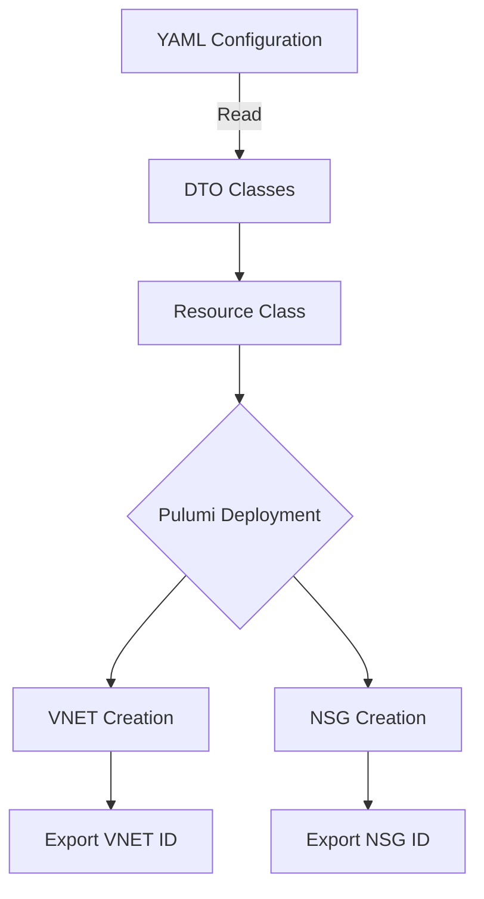
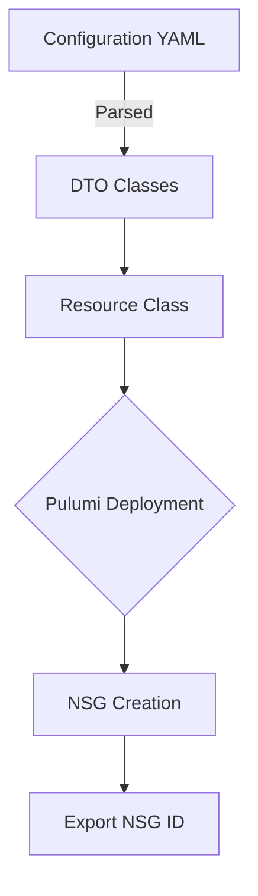
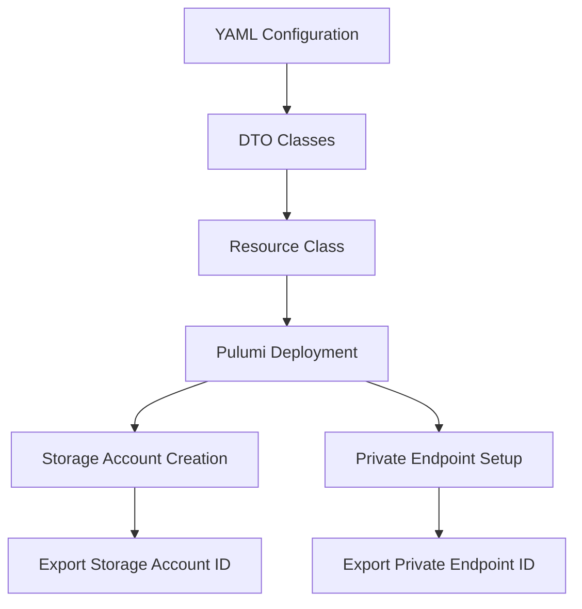
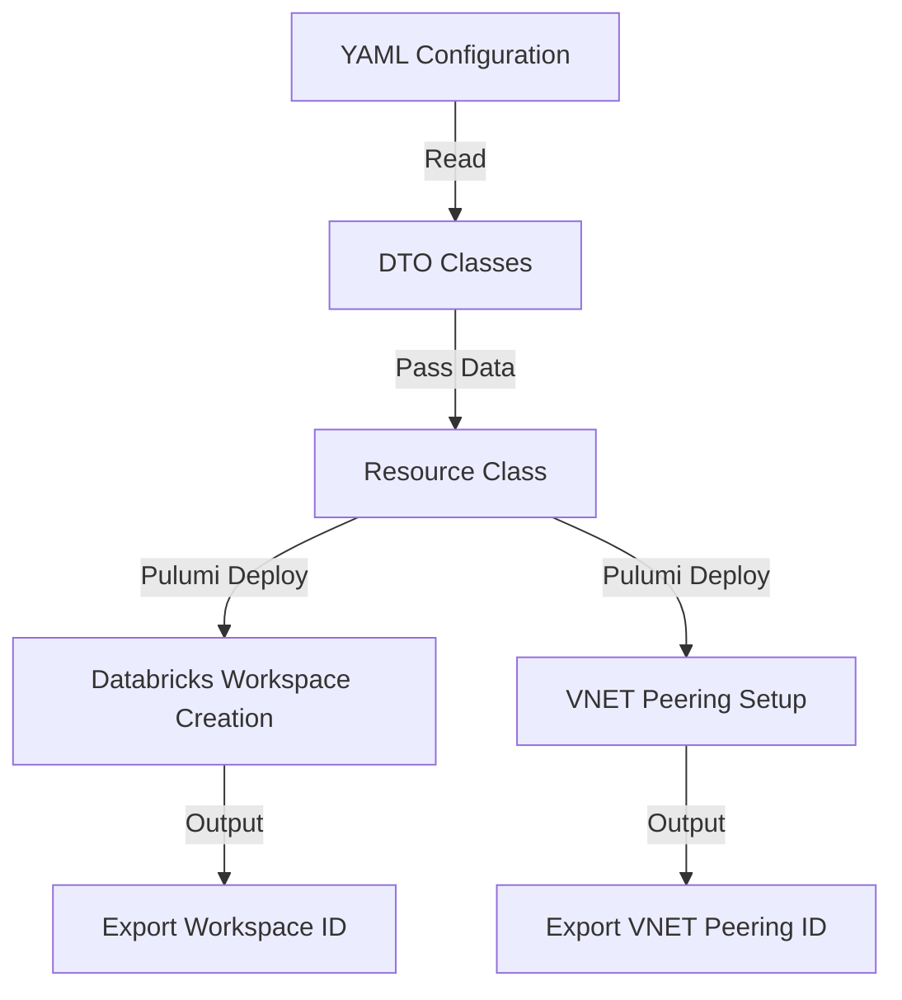
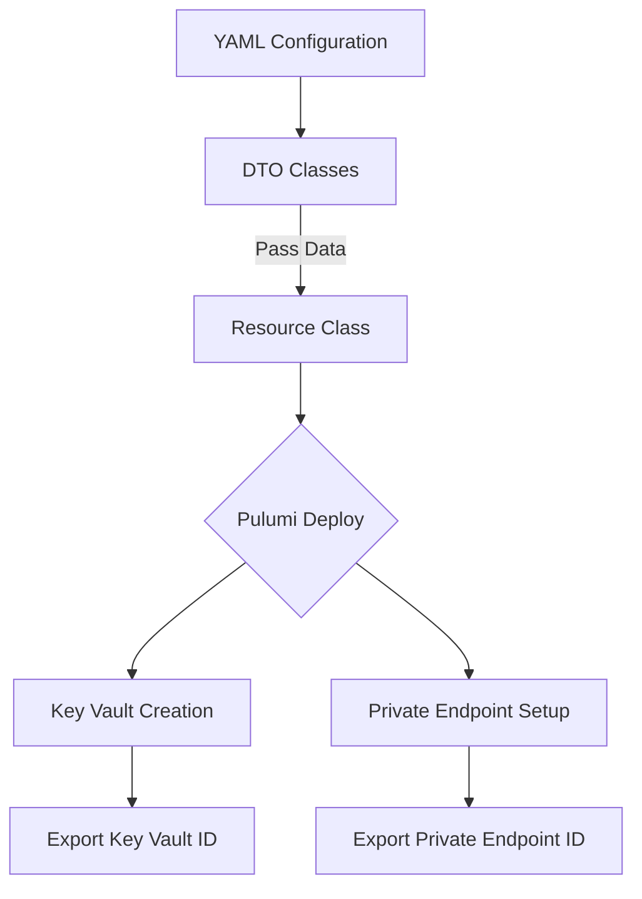
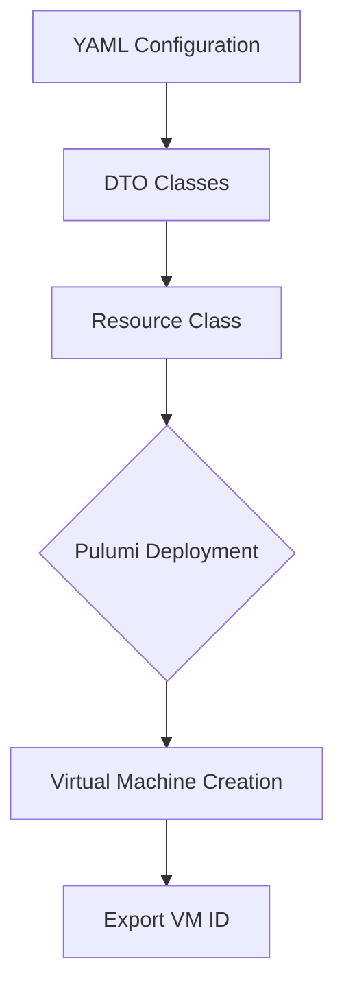
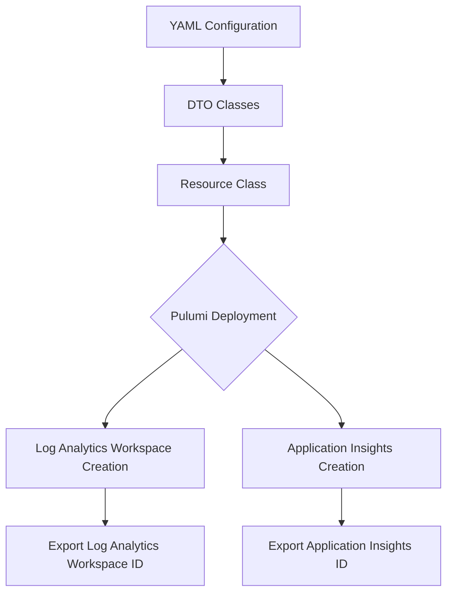
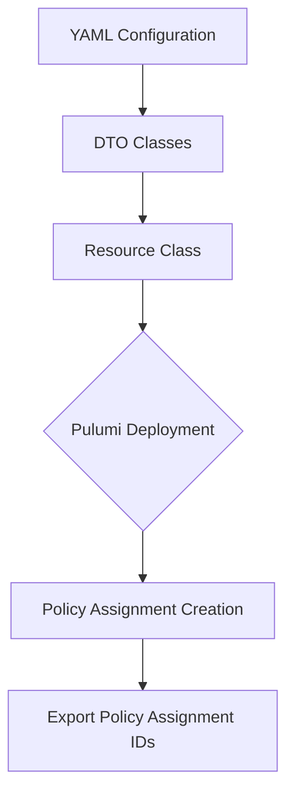
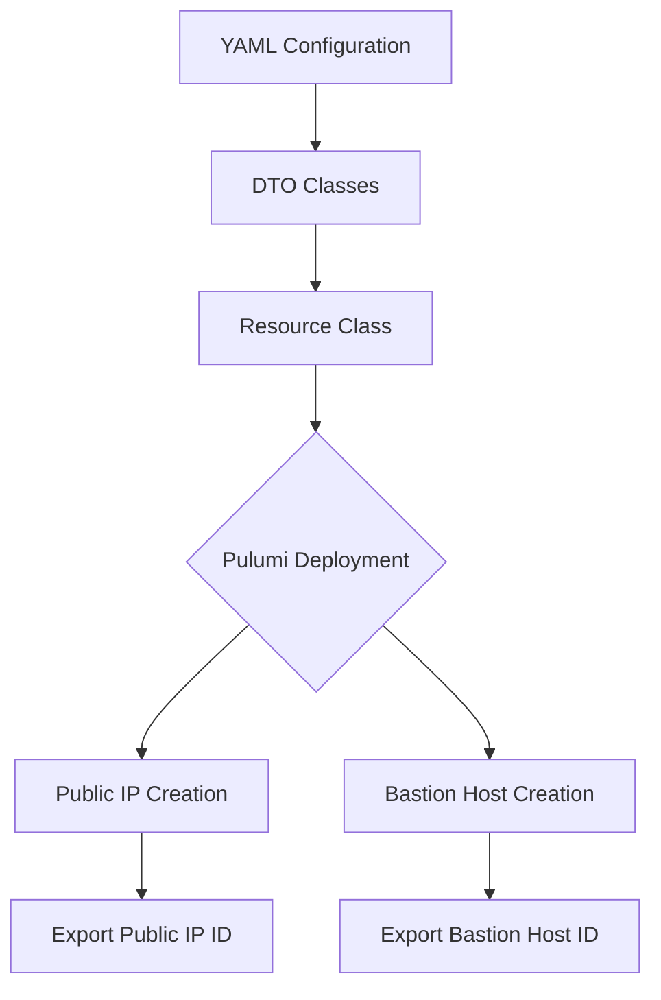

# bcamp_data_platform_azure

BCAMP and Applied Curiosity's Data Platform Infrastructure

## Azure Walking Skeleton

### Step 1: Create a Git Repository to Hold Our Infrastructure as Code

**Objective:** Set up a central repository to store and manage your Infrastructure as Code (IaC) using Git.

**Instructions:**

1. **Set up Git (if not already installed):**
   - On your local machine, check if Git is installed by running `git --version` in your terminal. If it's not installed, download and install Git from [git-scm.com](https://git-scm.com/).
2. **Create a new repository on GitHub:**
   - Log in to your GitHub account.
   - Navigate to the Repositories tab and click on 'New' to create a new repository.
   - Name your repository `bcamp_data_platform_azure`.
   - Choose whether to make the repository public or private.
   - Initialize the repository with a README file to provide an overview of the project.
   - Initialize with a Python `.gitignore` file to protect environment variables and avoid checking in libraries
   - Click on 'Create repository'.
3. **Clone the repository to your local machine:**

   - Once the repository is created, click the 'Code' button and copy the URL provided.
   - Open your terminal, navigate to the directory where you want to store the project, and run:

     ```
     git clone [URL]

     ```

   - Replace `[URL]` with the URL you copied from GitHub.

4. **Create a directory structure:**

   - Inside your local repository, create a directory named `infra` to store your Pulumi projects:

     ```
     mkdir infra
     cd infra

     ```

5. **Initial Commit:**

   - Add the newly created directory to Git:

     ```
     git add infra
     git commit -m "Initial commit: Setup infra directory for Pulumi projects"

     ```

   - Push the changes to GitHub:

     ```
     git push origin main

     ```

### Step 2: Install the Pulumi Library

**Objective:** Install Pulumi on your local machine to manage and deploy your infrastructure as code.

**Instructions:**

1. **Download Pulumi:**
   - Visit the [Pulumi Downloads page](https://www.pulumi.com/docs/get-started/install/) and select the installer appropriate for your operating system (Windows, macOS, or Linux).
2. **Install Pulumi:**

   - For macOS and Linux:

     - Open a terminal and run the script provided on the Pulumi website. For example:

       ```
       curl -fsSL <https://get.pulumi.com> | sh

       ```

   - For Windows:
     - Download the installer and execute it to install Pulumi.

3. **Verify Installation:**

   - After installation, reopen your terminal or command prompt and run:

     ```
     pulumi version

     ```

   - This command should display the version of Pulumi installed, confirming that the installation was successful.

4. **Set up the Pulumi configuration:**

   - Pulumi requires you to log in to a backend where it can store state and perform operations. For initial setup and testing, you can use the Pulumi-managed service by running:

     ```
     pulumi login

     ```

   - This command will prompt you to log in via a web browser.
   - **_Special note_** - if you’re using codespaces or container development, you will need to use your personal access token from Pulumi to authenticate. You can retrieve this token from the Pulumi website by clicking your profile icon in the top right corner. In the dropdown menu select personal access token.

5. **Configure Pulumi for Python:**

   - Ensure Python is installed on your system by running:

     ```
     python --version

     ```

   - If Python is not installed, download and install it from the [official Python website](https://www.python.org/downloads/).
   - Install the Python package manager, pip, if it's not included in your Python installation:

     ```
     python -m ensurepip --upgrade

     ```

   - Set up a virtual environment in your project directory (`infra`) to manage Python dependencies:

     ```
     python -m venv venv
     source venv/bin/activate  # On Windows use `venv\\Scripts\\activate`

     ```

   - Install the Pulumi Python SDK in the virtual environment:

     ```
     pip install pulumi

     ```

### Step 3: Install the Library for the Cloud Environment (Azure)

**Objective:** Install the necessary Pulumi library for Azure to manage resources in the Azure cloud.

**Instructions:**

1. **Activate your Python environment:**

   - Make sure you are in your project's root directory (where the `infra` directory is located).
   - Activate the Python virtual environment by running:

     ```
     source venv/bin/activate  # On Windows use `venv\\Scripts\\activate`

     ```

2. **Install the Pulumi Azure Provider:**

   - Use pip to install the Pulumi Azure provider. Run:

     ```
     pip install pulumi_azure

     ```

   - This command installs the Pulumi Azure SDK which allows you to write infrastructure code that provisions and manages Azure resources.

3. **Verify the installation:**

   - To ensure that the Azure provider was installed correctly, you can check the installed packages in your virtual environment:

     ```
     pip list

     ```

   - Look for `pulumi` and `pulumi_azure` in the list of installed packages to confirm their installation.

4. **Configure Azure settings:**

   - Set up the Azure provider configuration by running:

     ```
     pulumi config set azure:location <preferred-location>

     ```

   - Replace `<preferred-location>` with the Azure region you prefer, such as `eastus`, `westeurope`, etc.

5. **Authentication:**

   - Since you are using federated credentials in Azure, ensure your local environment is configured to authenticate with Azure. This might involve setting up the Azure CLI and logging in:

     ```
     az login

     ```

   - This step is crucial for Pulumi to perform operations on your Azure account.

6. **Test the setup:**

   - Create a simple Pulumi script to test the setup. In the `infra` directory, create a Python file, say `test_azure.py`, and write a basic script to list resource groups as a test:

     ```python
     import pulumi_azure as azure

     # List all resource groups
     resource_groups = azure.core.get_resource_groups()
     for rg in resource_groups:
         pulumi.export(rg.name, rg.location)

     ```

   - Run this script using:

     ```
     pulumi up

     ```

   - This command will execute the script and should output the resource groups in your Azure subscription if everything is configured correctly.

### Step 3: Install the Library for the Cloud Environment (Azure)

**Objective:** Install and configure the Azure CLI, which is essential for managing Azure resources directly from the command line.

**Instructions:**

1. **Install Azure CLI:**

   - Visit the [Install Azure CLI](https://docs.microsoft.com/en-us/cli/azure/install-azure-cli) page and follow the instructions for your operating system.
   - For most systems, you can install Azure CLI via a single command. For instance, on macOS, you can use Homebrew:

     ```
     brew update && brew install azure-cli

     ```

   - On Windows, you can install it using the MSI installer available from Microsoft.

2. **Verify Installation:**

   - Open a new terminal or command prompt and run:

     ```
     az --version

     ```

   - This command will display the Azure CLI version along with other relevant information. Ensure that the Azure CLI is properly installed.

3. **Login to Azure:**

   - To configure the Azure CLI to use your Azure subscription, run:

     ```
     az login

     ```

   - This command will open a web browser asking you to log in to your Azure account. Once logged in, the CLI will be connected to your Azure subscription.

4. **Set the Default Subscription:**

   - If you have multiple Azure subscriptions, set the default one for your operations:

     ```
     az account set --subscription "Name or ID of Your Subscription"

     ```

   - Replace "Name or ID of Your Subscription" with the actual name or ID of the subscription you intend to use for deploying resources.

5. **Check Connectivity and Permissions:**

   - Run a simple command to list Azure resource groups to confirm proper setup and connectivity:

     ```
     az group list --output table

     ```

   - This command shows a table of all resource groups in your subscription, confirming that your CLI is configured correctly and has the necessary permissions.

### Step 4: Create the Project from the Git Repository Using Pulumi

**Objective:** Set up a new Pulumi project within your existing `infra` directory in your repository, tailored for Azure using Python.

**Instructions:**

1. **Navigate to Your `infra` Directory:**

   - Open your terminal, and make sure you are in the root directory of your cloned repository (`bcamp_data_platform_azure`). Then navigate to the `infra` directory:

     ```
     cd infra

     ```

2. **Create a New Pulumi Project:**

   - Initiate the creation of a new Pulumi project by running:

     ```
     pulumi new bcamp_data_platform_azure

     ```

   - This command will scaffold a new Pulumi project set up for Python development with Azure. It includes sample code and dependencies in a Python virtual environment.

3. **Configure the Project:**
   - During the setup, you will be prompted to enter several details:
     - **Project Name:** You can accept the default name suggested by Pulumi or provide a new one. For consistency, let's name it based on our repository structure, e.g., `bcamp_data_platform_azure`.
     - **Project Description:** Provide a brief description, e.g., "A minimal Azure Native Pulumi program."
4. **Set Up a Stack:**
   - You will be asked to provide a stack name. A stack in Pulumi represents an isolated environment within your project. You can use the default name, `dev`, or specify another name that reflects your deployment stage, such as `production` or `test`.
5. **Choose Azure Location:**

   - Specify the Azure location where your resources will be deployed. You can accept the default or choose another location. To list all available locations, use:

     ```
     az account list-locations --output table

     ```

   - Set the location for your stack with:

     ```
     pulumi config set azure-native:location [location-name]

     ```

   - Replace `[location-name]` with your chosen location, such as `centralus`.

6. **Finalize and Review Project Files:**
   - Once the project setup is complete, review the created files within the `infra` directory. You should have a `Pulumi.yaml` for project settings, `__main__.py` for your Python code, and a virtual environment folder for Python packages.
7. **Commit the New Project to Git:**

   - Add the new Pulumi project files to your Git repository:

     ```
     git add .
     git commit -m "Setup new Pulumi project for Azure in Python"

     ```

   - Push the changes to your GitHub repository:

     ```
     git push origin main

     ```

### **Step 5: Create an Authentication and Authorization Principal Cloud Service Account**

**Objective:** Set up an Azure service principal with Federated Identity Credential to allow GitHub Actions to deploy resources securely.

**Instructions:**

1. **Create a Service Principal:**

   - Open the Azure CLI and run the following command to create a new application and service principal:

     ```css
     cssCopy code
     az ad sp create-for-rbac --name <YourAppName> --role contributor --scopes /subscriptions/{subscription-id}/resourceGroups/{resource-group}

     ```

   - Replace **`<YourAppName>`**, **`{subscription-id}`**, and **`{resource-group}`** with your application name, Azure subscription ID, and resource group name respectively.

2. **Assign Role to Service Principal:**
   - Assign a role to the service principal to define the permissions it has on Azure resources. The 'Contributor' role is commonly used for deployment tasks.
3. **Configure Federated Identity Credential:**
   - Navigate to the Azure portal, go to 'App registrations', select your app, and then go to 'Certificates & secrets'.
   - Add a new federated credential tailored for GitHub Actions, specifying details like the GitHub organization and repository.
4. **Create GitHub Secrets:**
   - In your GitHub repository, navigate to 'Settings' > 'Security' > 'Secrets and variables' > 'Actions'.
   - Add secrets for **`AZURE_CLIENT_ID`**, **`AZURE_TENANT_ID`**, and **`AZURE_SUBSCRIPTION_ID`** with values obtained from your Azure service principal.
5. **Update GitHub Actions Workflow:**
   - Modify your GitHub Actions workflow file to include steps for Azure authentication using the secrets you stored. Use the **`azure/login@v1`** action with parameters like **`client-id`**, **`tenant-id`**, and **`subscription-id`** obtained from your Azure service principal.

### Step 6: Build a Minimal GitHub Action to Test Deployment

**Objective:** Create a GitHub Action to automate the deployment of your Azure resources using Pulumi.

**Instructions:**

1. **Create a GitHub Workflow File:**

   - In your repository (`bcamp_data_platform_azure`), navigate to the `.github/workflows` directory. If this directory doesn't exist, create it:

     ```
     mkdir -p .github/workflows

     ```

   - Create a new file named `azure_deploy.yml` in this directory.

2. **Define the Workflow:**

   - Edit `azure_deploy.yml` to define the workflow. Start by specifying the name and trigger conditions. For example:

     ```yaml
     name: Deploy Azure Infrastructure
     on:
       push:
         branches:
           - main
       workflow_dispatch:
     ```

   - This configuration triggers the workflow on pushes to the `main` branch and allows manual triggering from the GitHub interface.

3. **Set Up Jobs and Steps:**

   - Define a job to run the deployment. Configure it to run on an Ubuntu runner and include steps to check out the code, set up Python, install dependencies, and execute Pulumi commands. For instance:

     ```yaml
             name: Deploy Azure Infrastructure with Pulumi
             on:
             workflow_dispatch:

             permissions:
                 id-token: write
                 contents: read

             jobs:
             build-and-deploy:
                 runs-on: ubuntu-latest
                 steps:
                 - name: Checkout Code
                     uses: actions/checkout@v4

                 - name: Setup Python
                     uses: actions/setup-python@v4
                     with:
                     python-version: '3.x'

                 - name: Installing dependencies
                     run: |
                     pip install -r $GITHUB_WORKSPACE/infra/requirements.txt

                 - name: Deploy with Pulumi
                     uses: pulumi/actions@v5
                     with:
                     command: up
                     stack-name: applied-curiosity/bcamp_data_platform_azure/dev1
                     work-dir: infra
                     env:
                     PULUMI_ACCESS_TOKEN: ${{ secrets.PULUMI_ACCESS_TOKEN }}
                     ARM_USE_OIDC: 'true'
                     ARM_CLIENT_ID: ${{ secrets.AZURE_CLIENT_ID }}
                     ARM_TENANT_ID: ${{ secrets.AZURE_TENANT_ID }}
                     ARM_SUBSCRIPTION_ID: ${{ secrets.AZURE_SUBSCRIPTION_ID }}

     ```

4. **Push Changes to GitHub:**

   - Commit and push your changes to the repository:

     ```
     git add .github/workflows/azure_deploy.yml
     git commit -m "Add GitHub Actions workflow for Azure deployment"
     git push origin main

     ```

### Step 7: Check in a Minimal Resource for Deployment and Allow the Action to Deploy the Resource

**Objective:** Add a minimal Azure resource definition in your Pulumi project and use the GitHub Action to deploy it.

**Instructions:**

1. **Define a Minimal Azure Resource:**

   - In your Pulumi project within the `infra` directory, edit the `__main__.py` file to define a minimal resource, such as an Azure Resource Group. For example:

     ```python
     import pulumi
     from pulumi_azure_native import resources

     # Create an Azure Resource Group
     # Naming convention is
     # rg = resource group
     # ac = Applied Curiosity
     # cus = Central US
     # adb = Azure Databricks
     # acclrtor = Accelerator
     resource_group = resources.ResourceGroup('rg-ac-cus-adb-acclrtor')

     ```

   - This code snippet creates a new resource group in Azure.

2. **Commit and Push the Changes:**

   - Add the changes to your Git repository:

     ```
     git add infra/__main__.py
     git commit -m "Add minimal Azure resource group definition"
     git push origin main

     ```

3. **Monitor GitHub Actions Workflow:**
   - After pushing the changes, navigate to the 'Actions' tab in your GitHub repository to monitor the workflow execution.
   - The GitHub Action you set up in the previous step will trigger, building and deploying the new resource using Pulumi.
4. **Verify Deployment:**

   - Check the output of the GitHub Action to confirm that the deployment was successful.
   - Optionally, use the Azure CLI to verify the resource was created:

     ```
     az group show --name rg-ac-cus-adb-acclrtor

     ```

# Azure Plan

Because we put most our effort into the AWS plan, we’ll keep this one a little shorter. It’s basically going to follow a similar path, with the exception that we’re deploying to Azure.

## **Proposed Project Structure for Azure Databricks Deployment with Pulumi**

```
plaintextCopy code
/my-databricks-deployment
│
├── infra/
│   ├── __main__.py               # Orchestrates the resource deployment with Pulumi
│   ├── Pulumi.yaml               # Project metadata and settings
│   ├── config/                   # Configuration files for different environments
│   │   ├── dev.yml               # Development environment configuration
│   │   ├── stage.yml             # Staging environment configuration
│   │   ├── prod.yml              # Production environment configuration
│   │
│   ├── dto.py                    # Data Transfer Object definitions for configurations
│   ├── resources/                # Individual resource modules using the DTO
│   │   ├── networking.py         # Management of Hub and Spoke VNETs and related networking
│   │   ├── security.py           # NSGs, Firewall configurations, and endpoint security
│   │   ├── databricks.py         # Databricks workspace, clusters, and security settings
│   │   ├── storage.py            # Storage accounts and private endpoints setup
│   │   ├── keyvault.py           # Azure Key Vault setups and secret scopes
│   │   ├── compute.py            # Setup for secured Windows VMs with RDP
│   │   ├── bastion.py            # Setup for Bastion secure connection
│   │   ├── monitoring.py         # Log Analytics and Azure Monitor configurations
│   │   ├── compliance.py         # Compliance checks and documentation tools
│   │
└── README.md                     # Overview, setup instructions, and other documentation

```

### **Rationale Behind Each Component**

- **`config/`**:
  - Configuration files allow easy parameter tuning for different deployment stages (development, staging, production), enhancing maintainability and environment-specific customization.
- **`dto.py`**:
  - Centralizes the configuration definitions, ensuring that all modules receive consistent data inputs, which reduces redundancy and potential configuration errors.
- **`resources/`**:
  - **`networking.py`**: Manages complex network configurations like hub and spoke models. These are critical for segmenting resources effectively and maintaining robust security boundaries.
  - **`security.py`**: Sets up network security groups, firewalls, and manages the overall security posture, ensuring compliance with security best practices.
  - **`databricks.py`**: Manages the deployment of Databricks workspaces, clusters, and integrates security features like endpoint configurations and cluster policies.
  - **`storage.py`**: Handles the provisioning of storage accounts with privacy and security configurations such as private endpoints.
  - **`keyvault.py`**: Manages Key Vault resources and ensures secure handling of secrets, certificates, and keys via private endpoints.
  - **`compute.py`**: Configures secure compute instances, particularly for roles requiring secure access like admin operations.
  - **`monitoring.py`**: Sets up monitoring and logging through Azure Monitor and Log Analytics to ensure operational visibility and compliance with logging requirements.
  - **`compliance.py`**: Focuses on maintaining compliance standards, implementing policies, and documenting configurations and changes for audit purposes.
- **`README.md`**:
  - Provides a detailed description of the project setup, architecture, and guides for developers or operators on how to deploy and maintain the infrastructure.

This structure supports scalability and ease of updates, allowing new resources or adjustments to be integrated smoothly. By using Pulumi and this organized project structure, you can ensure that your Azure Databricks environment is both robust and aligned with enterprise-level deployment practices. This setup will facilitate better manageability, security, and compliance across your cloud infrastructure.

## Network.py

### **1. YAML Configuration**

Start by defining the necessary parameters in a YAML file for different environments. Here’s an example for the Virtual Network configuration:

**dev.yml:**

```yaml
yamlCopy code
networking:
  vnet_name: dev-vnet
  address_space: "10.0.0.0/16"
  subnets:
    - name: subnet1
      address_prefix: "10.0.1.0/24"
    - name: subnet2
      address_prefix: "10.0.2.0/24"
  nsg:
    - name: dev-nsg
      rules:
        - name: allow-ssh
          priority: 100
          direction: Inbound
          access: Allow
          protocol: Tcp
          source_port_range: "*"
          destination_port_range: "22"
          source_address_prefix: "*"
          destination_address_prefix: "*"

```

### **2. DTO Python Class**

Define a Data Transfer Object (DTO) to encapsulate and type-check the configuration data passed to the Pulumi scripts.

**dto.py:**

```python
pythonCopy code
from dataclasses import dataclass, field
from typing import List

@dataclass
class SubnetConfig:
    name: str
    address_prefix: str

@dataclass
class NSGRuleConfig:
    name: str
    priority: int
    direction: str
    access: str
    protocol: str
    source_port_range: str
    destination_port_range: str
    source_address_prefix: str
    destination_address_prefix: str

@dataclass
class NetworkConfig:
    vnet_name: str
    address_space: str
    subnets: List[SubnetConfig]
    nsg: List[NSGRuleConfig]

```

### **3. Resource Python Class**

Implement the resource module in Python using the Pulumi Azure Native provider.

**networking.py:**

```python
pythonCopy code
import pulumi
from pulumi_azure_native import network
from dto import NetworkConfig, SubnetConfig, NSGRuleConfig

def create_network(config: NetworkConfig):
    # Create the Virtual Network
    vnet = network.VirtualNetwork(
        config.vnet_name,
        address_space=network.AddressSpaceArgs(
            address_prefixes=[config.address_space]
        ),
        subnets=[network.SubnetArgs(
            name=sub.name,
            address_prefix=sub.address_prefix
        ) for sub in config.subnets],
        resource_group_name=pulumi.Config().require("resource_group_name")
    )

    # Create Network Security Group with rules
    nsg = network.NetworkSecurityGroup(
        config.nsg[0].name,
        security_rules=[network.SecurityRuleArgs(
            name=rule.name,
            priority=rule.priority,
            direction=rule.direction,
            access=rule.access,
            protocol=rule.protocol,
            source_port_range=rule.source_port_range,
            destination_port_range=rule.destination_port_range,
            source_address_prefix=rule.source_address_prefix,
            destination_address_prefix=rule.destination_address_prefix
        ) for rule in config.nsg],
        resource_group_name=pulumi.Config().require("resource_group_name")
    )

    pulumi.export('vnet_id', vnet.id)
    pulumi.export('nsg_id', nsg.id)

# Assuming config is loaded from the YAML
config_data = NetworkConfig(
    vnet_name="example-vnet",
    address_space="10.0.0.0/16",
    subnets=[
        SubnetConfig(name="subnet1", address_prefix="10.0.1.0/24")
    ],
    nsg=[
        NSGRuleConfig(
            name="allow-ssh",
            priority=100,
            direction="Inbound",
            access="Allow",
            protocol="Tcp",
            source_port_range="*",
            destination_port_range="22",
            source_address_prefix="*",
            destination_address_prefix="*"
        )
    ]
)
create_network(config_data)

```

### **4. Mermaid Diagram**

Here’s a Mermaid diagram to illustrate the deployment process of the networking resources:



This setup ensures that your Azure networking resources are defined in a modular, maintainable, and scalable way.

## Security.py

### **1. YAML Configuration**

This configuration specifies the parameters for NSG, including rules that determine how inbound and outbound traffic should be controlled.

**security.yml:**

```yaml
yamlCopy code
nsg_config:
  name: main-nsg
  location: eastus
  resource_group_name: pulumi-resources
  security_rules:
    - name: allow-http
      priority: 100
      direction: Inbound
      access: Allow
      protocol: Tcp
      source_port_range: "*"
      destination_port_range: "80"
      source_address_prefix: "*"
      destination_address_prefix: "*"
    - name: allow-https
      priority: 110
      direction: Inbound
      access: Allow
      protocol: Tcp
      source_port_range: "*"
      destination_port_range: "443"
      source_address_prefix: "*"
      destination_address_prefix: "*"

```

### **2. DTO Python Class**

The Data Transfer Object (DTO) helps in validating and transferring data from the configuration to the Pulumi script.

**dto.py:**

```python
pythonCopy code
from dataclasses import dataclass, field
from typing import List

@dataclass
class SecurityRuleConfig:
    name: str
    priority: int
    direction: str
    access: str
    protocol: str
    source_port_range: str
    destination_port_range: str
    source_address_prefix: str
    destination_address_prefix: str

@dataclass
class NSGConfig:
    name: str
    location: str
    resource_group_name: str
    security_rules: List[SecurityRuleConfig]

```

### **3. Resource Python Class**

This class uses the Pulumi Azure Native SDK to create an NSG with the rules defined in the DTO.

**security.py:**

```python
pythonCopy code
import pulumi
from pulumi_azure_native import network
from dto import NSGConfig, SecurityRuleConfig

def create_nsg(config: NSGConfig):
    nsg = network.NetworkSecurityGroup(
        config.name,
        resource_group_name=config.resource_group_name,
        location=config.location,
        security_rules=[network.SecurityRuleArgs(
            name=rule.name,
            priority=rule.priority,
            direction=rule.direction,
            access=rule.access,
            protocol=rule.protocol,
            source_port_range=rule.source_port_range,
            destination_port_range=rule.destination_port_range,
            source_address_prefix=rule.source_address_prefix,
            destination_address_prefix=rule.destination_address_prefix,
        ) for rule in config.security_rules]
    )
    pulumi.export('nsg_id', nsg.id)

# Example usage
nsg_config = NSGConfig(
    name="main-nsg",
    location="eastus",
    resource_group_name="pulumi-resources",
    security_rules=[
        SecurityRuleConfig(
            name="allow-http",
            priority=100,
            direction="Inbound",
            access="Allow",
            protocol="Tcp",
            source_port_range="*",
            destination_port_range="80",
            source_address_prefix="*",
            destination_address_prefix="*"
        ),
        SecurityRuleConfig(
            name="allow-https",
            priority=110,
            direction="Inbound",
            access="Allow",
            protocol="Tcp",
            source_port_range="*",
            destination_port_range="443",
            source_address_prefix="*",
            destination_address_prefix="*"
        )
    ]
)
create_nsg(nsg_config)

```

### **4. Mermaid Diagram**

A visual representation of the deployment process of network security using a Mermaid diagram:



This setup and the detailed code snippets should help you manage the security configuration effectively, creating a secure and robust Azure environment using Pulumi.

## storage.py

### **1. YAML Configuration**

This configuration specifies the parameters for creating and managing an Azure Blob Storage account, including properties like account tier, replication type, and private endpoints.

**storage.yml:**

```yaml
yamlCopy code
storage_account:
  name: pulumiStorageAccount
  resource_group_name: pulumi-resources
  location: eastus
  account_tier: Standard
  replication_type: LRS
  private_endpoint:
    name: storagePrivateEndpoint
    subnet_id: /subscriptions/{sub-id}/resourceGroups/{rg}/providers/Microsoft.Network/virtualNetworks/{vnet}/subnets/{subnet}

```

### **2. DTO Python Class**

The Data Transfer Object (DTO) helps ensure that data passed from the configuration to the Pulumi script is structured and type-safe.

**dto.py:**

```python
pythonCopy code
from dataclasses import dataclass

@dataclass
class PrivateEndpointConfig:
    name: str
    subnet_id: str

@dataclass
class StorageAccountConfig:
    name: str
    resource_group_name: str
    location: str
    account_tier: str
    replication_type: str
    private_endpoint: PrivateEndpointConfig

```

### **3. Resource Python Class**

This class uses the Pulumi Azure Native SDK to create a Blob Storage account and configure a private endpoint.

**storage.py:**

```python
pythonCopy code
import pulumi
from pulumi_azure_native import storage, network
from dto import StorageAccountConfig, PrivateEndpointConfig

def create_storage_account(config: StorageAccountConfig):
    # Create the Storage Account
    account = storage.StorageAccount(
        config.name,
        resource_group_name=config.resource_group_name,
        location=config.location,
        sku=storage.SkuArgs(
            name=f"{config.account_tier}_{config.replication_type}"
        ),
        kind="StorageV2"
    )

    # Setup the Private Endpoint
    private_endpoint = network.PrivateEndpoint(
        config.private_endpoint.name,
        private_link_service_connections=[network.PrivateLinkServiceConnectionArgs(
            name=f"{config.name}-plsConnection",
            private_link_service_id=account.id,
            group_ids=["blob"],
            sub_resource_names=["blob"]
        )],
        subnet=network.SubnetArgs(
            id=config.private_endpoint.subnet_id
        ),
        resource_group_name=config.resource_group_name
    )

    pulumi.export('storage_account_id', account.id)
    pulumi.export('private_endpoint_id', private_endpoint.id)

# Example usage
storage_config = StorageAccountConfig(
    name="pulumiStorageAccount",
    resource_group_name="pulumi-resources",
    location="eastus",
    account_tier="Standard",
    replication_type="LRS",
    private_endpoint=PrivateEndpointConfig(
        name="storagePrivateEndpoint",
        subnet_id="/subscriptions/{sub-id}/resourceGroups/{rg}/providers/Microsoft.Network/virtualNetworks/{vnet}/subnets/{subnet}"
    )
)
create_storage_account(storage_config)

```

### **4. Mermaid Diagram**

This diagram illustrates the process of deploying Azure Blob Storage and setting up a private endpoint with Pulumi:



This setup ensures that your Azure Blob Storage resources are provisioned in a secure, manageable, and structured way, adhering to best practices for cloud resource management with Pulumi.

## Databricks.py

### 1. YAML Configuration

The YAML configuration specifies the parameters for creating a Databricks workspace including network configurations and security features.

**databricks.yml:**

```yaml
databricks_workspace:
  name: pulumiDatabricksWorkspace
  resource_group_name: pulumi-resources
  location: eastus
  sku: "standard"
  managed_resource_group: pulumiDatabricksManagedRG
  vnet_peering:
    name: pulumiVnetPeering
    remote_vnet_id: /subscriptions/{sub-id}/resourceGroups/{rg}/providers/Microsoft.Network/virtualNetworks/{vnet}
```

### 2. DTO Python Class

Define a Data Transfer Object (DTO) class to encapsulate and manage the data types for the Databricks workspace setup.

[\*\*dto.py](http://dto.py/):\*\*

```python
from dataclasses import dataclass

@dataclass
class VnetPeeringConfig:
    name: str
    remote_vnet_id: str

@dataclass
class DatabricksWorkspaceConfig:
    name: str
    resource_group_name: str
    location: str
    sku: str
    managed_resource_group: str
    vnet_peering: VnetPeeringConfig

```

### 3. Resource Python Class

This class uses the Pulumi Azure Native SDK to create a Databricks workspace and configure VNET peering.

[\*\*databricks.py](http://databricks.py/):\*\*

```python
import pulumi
from pulumi_azure_native import databricks, network
from dto import DatabricksWorkspaceConfig, VnetPeeringConfig

def create_databricks_workspace(config: DatabricksWorkspaceConfig):
    # Create the Databricks Workspace
    workspace = databricks.Workspace(
        config.name,
        location=config.location,
        resource_group_name=config.resource_group_name,
        sku=databricks.SkuArgs(
            name=config.sku
        ),
        managed_resource_group_id=config.managed_resource_group
    )

    # Setup VNET Peering
    vnet_peering = network.VirtualNetworkPeering(
        config.vnet_peering.name,
        resource_group_name=config.resource_group_name,
        virtual_network_name=config.name,  # Assuming VNet is named after the workspace
        remote_virtual_network=network.SubResourceArgs(
            id=config.vnet_peering.remote_vnet_id
        )
    )

    pulumi.export('workspace_id', workspace.id)
    pulumi.export('vnet_peering_id', vnet_peering.id)

# Example usage
databricks_config = DatabricksWorkspaceConfig(
    name="pulumiDatabricksWorkspace",
    resource_group_name="pulumi-resources",
    location="eastus",
    sku="standard",
    managed_resource_group="pulumiDatabricksManagedRG",
    vnet_peering=VnetPeeringConfig(
        name="pulumiVnetPeering",
        remote_vnet_id="/subscriptions/{sub-id}/resourceGroups/{rg}/providers/Microsoft.Network/virtualNetworks/{vnet}"
    )
)
create_databricks_workspace(databricks_config)

```

### 4. Mermaid Diagram

This diagram illustrates the deployment process of Azure Databricks using Pulumi:



This workflow ensures the Azure Databricks environment is set up with appropriate networking and security configurations. The use of Pulumi streamlines the provisioning process and integrates well with cloud-native architectures.

## Keyvault.py

### **1. YAML Configuration**

Define the parameters for creating and configuring an Azure Key Vault, including enabling access policies and private endpoints.

**keyvault.yml:**

```yaml
yamlCopy code
key_vault:
  name: pulumiKeyVault
  resource_group_name: pulumi-resources
  location: eastus
  sku_name: standard
  tenant_id: {your-tenant-id}
  access_policies:
    - tenant_id: {your-tenant-id}
      object_id: {your-object-id}
      permissions:
        keys: ["get", "list", "create", "delete"]
        secrets: ["get", "list", "set", "delete"]
  private_endpoint:
    name: kvPrivateEndpoint
    subnet_id: /subscriptions/{sub-id}/resourceGroups/{rg}/providers/Microsoft.Network/virtualNetworks/{vnet}/subnets/{subnet}

```

### **2. DTO Python Class**

The DTO (Data Transfer Object) class encapsulates configuration data, improving code maintainability and reducing errors.

**dto.py:**

```python
pythonCopy code
from dataclasses import dataclass, field
from typing import List, Dict

@dataclass
class AccessPolicyEntry:
    tenant_id: str
    object_id: str
    permissions: Dict[str, List[str]]

@dataclass
class PrivateEndpointConfig:
    name: str
    subnet_id: str

@dataclass
class KeyVaultConfig:
    name: str
    resource_group_name: str
    location: str
    sku_name: str
    tenant_id: str
    access_policies: List[AccessPolicyEntry]
    private_endpoint: PrivateEndpointConfig

```

### **3. Resource Python Class**

This class uses the Pulumi Azure Native SDK to deploy Azure Key Vault with configured access policies and private endpoint.

**keyvault.py:**

```python
pythonCopy code
import pulumi
from pulumi_azure_native import keyvault, network
from dto import KeyVaultConfig, AccessPolicyEntry, PrivateEndpointConfig

def create_key_vault(config: KeyVaultConfig):
    # Create the Key Vault
    key_vault = keyvault.Vault(
        config.name,
        resource_group_name=config.resource_group_name,
        location=config.location,
        properties=keyvault.VaultPropertiesArgs(
            tenant_id=config.tenant_id,
            sku=keyvault.SkuArgs(name=config.sku_name),
            access_policies=[keyvault.AccessPolicyEntryArgs(
                tenant_id=ap.tenant_id,
                object_id=ap.object_id,
                permissions=keyvault.PermissionsArgs(
                    keys=ap.permissions.get('keys', []),
                    secrets=ap.permissions.get('secrets', [])
                )
            ) for ap in config.access_policies]
        )
    )

    # Setup the Private Endpoint
    private_endpoint = network.PrivateEndpoint(
        config.private_endpoint.name,
        subnet=network.SubnetArgs(id=config.private_endpoint.subnet_id),
        private_link_service_connections=[network.PrivateLinkServiceConnectionArgs(
            name=f"{config.name}-plsConnection",
            private_link_service_id=key_vault.id,
            group_ids=["vault"]
        )],
        resource_group_name=config.resource_group_name
    )

    pulumi.export('key_vault_id', key_vault.id)
    pulumi.export('private_endpoint_id', private_endpoint.id)

# Example usage
kv_config = KeyVaultConfig(
    name="pulumiKeyVault",
    resource_group_name="pulumi-resources",
    location="eastus",
    sku_name="standard",
    tenant_id="{your-tenant-id}",
    access_policies=[
        AccessPolicyEntry(
            tenant_id="{your-tenant-id}",
            object_id="{your-object-id}",
            permissions={
                "keys": ["get", "list", "create", "delete"],
                "secrets": ["get", "list", "set", "delete"]
            }
        )
    ],
    private_endpoint=PrivateEndpointConfig(
        name="kvPrivateEndpoint",
        subnet_id="/subscriptions/{sub-id}/resourceGroups/{rg}/providers/Microsoft.Network/virtualNetworks/{vnet}/subnets/{subnet}"
    )
)
create_key_vault(kv_config)

```

### **4. Mermaid Diagram**

Visualizing the deployment process of Azure Key Vault using Pulumi:



This structure ensures that Azure Key Vault resources are provisioned securely, enabling effective management of access to keys and secrets within your Azure environment.

## Compute.py

### **1. YAML Configuration**

We'll start by defining the YAML configuration for creating a secured Windows Virtual Machine. This configuration will include virtual machine size, image details, and network interface specifications.

**compute.yml:**

```yaml
virtual_machine:
  name: pulumiWinVM
  resource_group_name: pulumi-resources
  location: eastus
  vm_size: Standard_B2s
  network_interface_id: /subscriptions/{sub-id}/resourceGroups/{rg}/providers/Microsoft.Network/networkInterfaces/{nic-name}
  admin_username: adminuser
  admin_password: { your-secure-password }
  os_disk:
    caching: ReadWrite
    storage_account_type: Standard_LRS
  image:
    publisher: MicrosoftWindowsServer
    offer: WindowsServer
    sku: 2019-Datacenter
    version: latest
```

### **2. DTO Python Class**

We will then create a DTO class that encapsulates the necessary configuration for the virtual machine, including network interface and image specifications.

**dto.py:**

```python
pythonCopy code
from dataclasses import dataclass

@dataclass
class OSDiskConfig:
    caching: str
    storage_account_type: str

@dataclass
class ImageConfig:
    publisher: str
    offer: str
    sku: str
    version: str

@dataclass
class VirtualMachineConfig:
    name: str
    resource_group_name: str
    location: str
    vm_size: str
    network_interface_id: str
    admin_username: str
    admin_password: str
    os_disk: OSDiskConfig
    image: ImageConfig

```

### **3. Resource Python Class**

Using the Pulumi Azure Native SDK, this class will deploy a Windows Virtual Machine according to the specifications defined in the DTO.

**compute.py:**

```python
pythonCopy code
import pulumi
from pulumi_azure_native import compute, network
from dto import VirtualMachineConfig, OSDiskConfig, ImageConfig

def create_virtual_machine(config: VirtualMachineConfig):
    vm = compute.VirtualMachine(
        config.name,
        resource_group_name=config.resource_group_name,
        location=config.location,
        hardware_profile=compute.HardwareProfileArgs(
            vm_size=config.vm_size
        ),
        network_profile=compute.NetworkProfileArgs(
            network_interfaces=[compute.NetworkInterfaceReferenceArgs(
                id=config.network_interface_id,
                primary=True
            )]
        ),
        os_profile=compute.OSProfileArgs(
            computer_name=config.name,
            admin_username=config.admin_username,
            admin_password=config.admin_password
        ),
        storage_profile=compute.StorageProfileArgs(
            os_disk=compute.OSDiskArgs(
                create_option="FromImage",
                caching=config.os_disk.caching,
                managed_disk=compute.ManagedDiskParametersArgs(
                    storage_account_type=config.os_disk.storage_account_type
                )
            ),
            image_reference=compute.ImageReferenceArgs(
                publisher=config.image.publisher,
                offer=config.image.offer,
                sku=config.image.sku,
                version=config.image.version
            )
        )
    )

    pulumi.export('virtual_machine_id', vm.id)

# Example usage
vm_config = VirtualMachineConfig(
    name="pulumiWinVM",
    resource_group_name="pulumi-resources",
    location="eastus",
    vm_size="Standard_B2s",
    network_interface_id="/subscriptions/{sub-id}/resourceGroups/{rg}/providers/Microsoft.Network/networkInterfaces/{nic-name}",
    admin_username="adminuser",
    admin_password="{your-secure-password}",
    os_disk=OSDiskConfig(
        caching="ReadWrite",
        storage_account_type="Standard_LRS"
    ),
    image=ImageConfig(
        publisher="MicrosoftWindowsServer",
        offer="WindowsServer",
        sku="2019-Datacenter",
        version="latest"
    )
)
create_virtual_machine(vm_config)

```

### **4. Mermaid Diagram**

Visualize the setup process for a Windows VM in Azure using Pulumi:



This structure provides a clear path for deploying secure and managed Windows Virtual Machines in Azure, with administrative credentials, proper networking setup, and an optimized OS image. The DTO ensures that configurations are handled cleanly, while the resource class effectively translates these configurations into actual Azure resources.

## monitoring.py

Creating a monitoring setup with Pulumi involves provisioning Azure Monitor and Log Analytics to collect and analyze metrics and logs from your Azure resources. Below, I detail the YAML configuration, the DTO class, the Python resource class, and a Mermaid diagram for the process.

### 1. YAML Configuration

The YAML configuration file defines the setup for Azure Monitor and Log Analytics, including workspace settings and data sources to monitor.

**monitoring.yml:**

```yaml
log_analytics_workspace:
  name: pulumiLogAnalytics
  resource_group_name: pulumi-resources
  location: eastus
  sku: PerGB2018
  retention_in_days: 30

application_insights:
  name: pulumiAppInsights
  resource_group_name: pulumi-resources
  location: eastus
  application_type: web
```

### 2. DTO Python Class

Define Data Transfer Objects (DTOs) to manage data structures for the monitoring configurations.

[\*\*dto.py](http://dto.py/):\*\*

```python
from dataclasses import dataclass

@dataclass
class LogAnalyticsWorkspaceConfig:
    name: str
    resource_group_name: str
    location: str
    sku: str
    retention_in_days: int

@dataclass
class ApplicationInsightsConfig:
    name: str
    resource_group_name: str
    location: str
    application_type: str

```

### 3. Resource Python Class

Implement the resource class in Python using the Pulumi Azure Native SDK to create and manage Azure Monitor and Log Analytics workspace.

[\*\*monitoring.py](http://monitoring.py/):\*\*

```python
import pulumi
from pulumi_azure_native import insights, operationalinsights
from dto import LogAnalyticsWorkspaceConfig, ApplicationInsightsConfig

def create_monitoring_resources(log_config: LogAnalyticsWorkspaceConfig, app_config: ApplicationInsightsConfig):
    # Create Log Analytics Workspace
    log_workspace = operationalinsights.Workspace(
        log_config.name,
        resource_group_name=log_config.resource_group_name,
        location=log_config.location,
        sku=operationalinsights.WorkspaceSkuArgs(
            name=log_config.sku
        ),
        retention_in_days=log_config.retention_in_days
    )

    # Create Application Insights
    app_insights = insights.Component(
        app_config.name,
        resource_group_name=app_config.resource_group_name,
        location=app_config.location,
        application_type=app_config.application_type,
        kind="web"
    )

    pulumi.export('log_analytics_workspace_id', log_workspace.id)
    pulumi.export('application_insights_id', app_insights.id)

# Example usage
log_config = LogAnalyticsWorkspaceConfig(
    name="pulumiLogAnalytics",
    resource_group_name="pulumi-resources",
    location="eastus",
    sku="PerGB2018",
    retention_in_days=30
)

app_config = ApplicationInsightsConfig(
    name="pulumiAppInsights",
    resource_group_name="pulumi-resources",
    location="eastus",
    application_type="web"
)

create_monitoring_resources(log_config, app_config)

```

### 4. Mermaid Diagram

The Mermaid diagram visualizes the process for setting up monitoring using Pulumi:



This setup ensures robust monitoring of your Azure infrastructure, leveraging Azure Monitor and Log Analytics to gather, analyze, and act on telemetry data efficiently.

## compliance.py

To create a structured approach for managing compliance features within Azure using Pulumi, let's consider integrating compliance checks, policy assignments, and documentation. We will walk through the YAML configuration, DTO class, Python resource class, and provide a Mermaid diagram for the compliance setup.

### 1. YAML Configuration

The YAML configuration will specify the parameters for policy assignments and management features that ensure your Azure deployments comply with organizational and regulatory standards.

**compliance.yml:**

```yaml
policy_assignments:
  - name: pulumiAuditVMs
    policy_definition_id: /providers/Microsoft.Authorization/policyDefinitions/{policy-definition-id}
    scope: /subscriptions/{subscription-id}
    parameters:
      effect: audit
  - name: pulumiEnforceTags
    policy_definition_id: /providers/Microsoft.Authorization/policyDefinitions/{another-policy-definition-id}
    scope: /subscriptions/{subscription-id}
    parameters:
      tag_name: Project
      tag_value: PulumiProject
```

### 2. DTO Python Class

Define a Data Transfer Object (DTO) class for managing the data structures used for compliance settings, such as policy assignments.

[\*\*dto.py](http://dto.py/):\*\*

```python
from dataclasses import dataclass, field
from typing import List, Dict

@dataclass
class PolicyAssignment:
    name: str
    policy_definition_id: str
    scope: str
    parameters: Dict[str, str]

@dataclass
class ComplianceConfig:
    policy_assignments: List[PolicyAssignment]

```

### 3. Resource Python Class

This class uses Pulumi's Azure Native SDK to manage compliance-related resources such as policy assignments.

[\*\*compliance.py](http://compliance.py/):\*\*

```python
import pulumi
from pulumi_azure_native import authorization
from dto import ComplianceConfig, PolicyAssignment

def apply_compliance_policies(config: ComplianceConfig):
    for assignment in config.policy_assignments:
        policy_assignment = authorization.PolicyAssignment(
            assignment.name,
            policy_definition_id=assignment.policy_definition_id,
            scope=assignment.scope,
            parameters={k: authorization.ParameterValuesValueArgs(value=v) for k, v in assignment.parameters.items()}
        )
        pulumi.export(f'{assignment.name}_policy_assignment_id', policy_assignment.id)

# Example usage
compliance_config = ComplianceConfig(
    policy_assignments=[
        PolicyAssignment(
            name="pulumiAuditVMs",
            policy_definition_id="/providers/Microsoft.Authorization/policyDefinitions/{policy-definition-id}",
            scope="/subscriptions/{subscription-id}",
            parameters={"effect": "audit"}
        ),
        PolicyAssignment(
            name="pulumiEnforceTags",
            policy_definition_id="/providers/Microsoft.Authorization/policyDefinitions/{another-policy-definition-id}",
            scope="/subscriptions/{subscription-id}",
            parameters={"tag_name": "Project", "tag_value": "PulumiProject"}
        )
    ]
)
apply_compliance_policies(compliance_config)

```

### 4. Mermaid Diagram

This diagram visualizes the setup process for managing compliance using Pulumi:



The structure ensures that compliance settings are effectively managed and that all Azure resources adhere to specified policies, helping to maintain governance and control over cloud environments. This setup not only centralizes policy management but also facilitates the automation of compliance checks, making it easier to enforce and track compliance across your Azure subscriptions.

## bastion.py

Setting up an Azure Bastion service using Pulumi is a crucial step in ensuring secure, seamless RDP and SSH access to your virtual machines without exposing them directly to the public internet. This setup involves defining the YAML configuration, DTO Python class, Python resource class, and providing a Mermaid diagram to illustrate the deployment process.

### 1. YAML Configuration

The YAML configuration file specifies the parameters for creating an Azure Bastion host, which includes network settings and the deployment specifics.

**bastion.yml:**

```yaml
bastion_host:
  name: pulumiBastionHost
  resource_group_name: pulumi-resources
  location: eastus
  subnet_id: /subscriptions/{sub-id}/resourceGroups/{rg}/providers/Microsoft.Network/virtualNetworks/{vnet}/subnets/AzureBastionSubnet
  public_ip_address_name: pulumiBastionPublicIP
```

### 2. DTO Python Class

Define a Data Transfer Object (DTO) class to encapsulate and manage the data structures for the Bastion host setup.

[\*\*dto.py](http://dto.py/):\*\*

```python
from dataclasses import dataclass

@dataclass
class BastionHostConfig:
    name: str
    resource_group_name: str
    location: str
    subnet_id: str
    public_ip_address_name: str

```

### 3. Resource Python Class

Implement the resource class in Python using Pulumi's Azure Native SDK to deploy Azure Bastion along with the necessary public IP address.

[\*\*bastion.py](http://bastion.py/):\*\*

```python
import pulumi
from pulumi_azure_native import network
from dto import BastionHostConfig

def create_bastion_host(config: BastionHostConfig):
    # Create a public IP for Bastion
    public_ip = network.PublicIPAddress(
        config.public_ip_address_name,
        resource_group_name=config.resource_group_name,
        location=config.location,
        public_ip_allocation_method="Static",
        sku=network.PublicIPAddressSkuArgs(
            name="Standard"
        )
    )

    # Create Bastion Host
    bastion_host = network.BastionHost(
        config.name,
        resource_group_name=config.resource_group_name,
        location=config.location,
        ip_configurations=[network.BastionHostIPConfigurationArgs(
            name="bastionIpConfig",
            subnet=network.SubResourceArgs(
                id=config.subnet_id
            ),
            public_ip_address=network.SubResourceArgs(
                id=public_ip.id
            )
        )]
    )

    pulumi.export('bastion_host_id', bastion_host.id)
    pulumi.export('bastion_public_ip_id', public_ip.id)

# Example usage
bastion_config = BastionHostConfig(
    name="pulumiBastionHost",
    resource_group_name="pulumi-resources",
    location="eastus",
    subnet_id="/subscriptions/{sub-id}/resourceGroups/{rg}/providers/Microsoft.Network/virtualNetworks/{vnet}/subnets/AzureBastionSubnet",
    public_ip_address_name="pulumiBastionPublicIP"
)
create_bastion_host(bastion_config)

```

### 4. Mermaid Diagram

This diagram visualizes the deployment process for setting up Azure Bastion using Pulumi:



This setup ensures that your Azure infrastructure is accessible securely and maintains control over access, using Azure Bastion as the primary ingress point for managing VMs. This configuration is part of a broader security strategy to minimize direct exposure of VMs to the public internet.

## main.py & dto.py

### dto.py

This file will define all the necessary DTOs to encapsulate configurations for various resources like virtual networks, storage accounts, security details, etc.

```python
from dataclasses import dataclass, field
from typing import List, Dict

# Network configurations
@dataclass
class SubnetConfig:
    name: str
    address_prefix: str

@dataclass
class NetworkConfig:
    vnet_name: str
    address_space: str
    subnets: List[SubnetConfig]

# Storage configurations
@dataclass
class StorageAccountConfig:
    account_name: str
    sku_name: str
    kind: str
    replication_type: str

# Security configurations
@dataclass
class NSGRuleConfig:
    name: str
    priority: int
    direction: str
    access: str
    protocol: str
    source_port_range: str
    destination_port_range: str
    source_address_prefix: str
    destination_address_prefix: str

@dataclass
class NSGConfig:
    name: str
    rules: List[NSGRuleConfig]

# Bastion configurations
@dataclass
class BastionHostConfig:
    name: str
    public_ip_address_name: str
    subnet_id: str

# Complete configuration encapsulating all resources
@dataclass
class AzureConfig:
    network: NetworkConfig
    storage: StorageAccountConfig
    security: NSGConfig
    bastion: BastionHostConfig

```

### **main**.py

This script will utilize the DTOs to configure and deploy Azure resources. It will load configurations from YAML files (or other sources), create resources, and manage outputs.

**_The following is wrong, use the AWS main as a better example_**

```python
import pulumi
from pulumi_azure_native import network, storage, resources
import yaml
from dto import AzureConfig, NetworkConfig, SubnetConfig, StorageAccountConfig, NSGConfig, NSGRuleConfig, BastionHostConfig

# Load configurations
def load_config():
    with open('config.yaml', 'r') as f:
        config = yaml.safe_load(f)
    return AzureConfig(
        network=NetworkConfig(
            vnet_name=config['network']['vnet_name'],
            address_space=config['network']['address_space'],
            subnets=[SubnetConfig(**subnet) for subnet in config['network']['subnets']]
        ),
        storage=StorageAccountConfig(**config['storage']),
        security=NSGConfig(
            name=config['security']['name'],
            rules=[NSGRuleConfig(**rule) for rule in config['security']['rules']]
        ),
        bastion=BastionHostConfig(**config['bastion'])
    )

# Create network resources
def create_network(network_config: NetworkConfig):
    vnet = network.VirtualNetwork(
        network_config.vnet_name,
        address_space=network.AddressSpaceArgs(
            address_prefixes=[network_config.address_space]
        ),
        subnets=[network.SubnetArgs(
            name=subnet.name,
            address_prefix=subnet.address_prefix
        ) for subnet in network_config.subnets],
    )
    pulumi.export('vnet_id', vnet.id)

# Create storage account
def create_storage(storage_config: StorageAccountConfig):
    account = storage.StorageAccount(
        storage_config.account_name,
        account_replication_type=storage_config.replication_type,
        sku=storage.SkuArgs(name=storage_config.sku_name),
        kind=storage_config.kind,
    )
    pulumi.export('storage_account_id', account.id)

# Create security groups and rules
def create_security(nsg_config: NSGConfig):
    nsg = network.NetworkSecurityGroup(
        nsg_config.name,
        security_rules=[network.SecurityRuleArgs(
            name=rule.name,
            priority=rule.priority,
            direction=rule.direction,
            access=rule.access,
            protocol=rule.protocol,
            source_port_range=rule.source_port_range,
            destination_port_range=rule.destination_port_range,
            source_address_prefix=rule.source_address_prefix,
            destination_address_prefix=rule.destination_address_prefix,
        ) for rule in nsg_config.rules]
    )
    pulumi.export('nsg_id', nsg.id)

# Main orchestration function
def main():
    config = load_config()
    create_network(config.network)
    create_storage(config.storage)
    create_security(config.security)

if __name__ == "__main__":
    main()

```

This setup provides a structured approach to managing Azure resources with Pulumi, encapsulating configuration details within DTOs and organizing deployment logic within the main script.

# AWS Example

## main.py and dto.py

Let's structure the `__main__.py` and complete the `dto.py` file to support our Pulumi infrastructure as code (IaC) project. This setup will ensure that all configurations are loaded appropriately, and resources are instantiated based on those configurations.

### `__main__.py`

This is the entry point for the Pulumi project, where resources are created based on the configuration loaded from YAML files.

```python
import pulumi
from dto import ConfigDTO
import yaml
import os

# Import resource classes
from resources.iam import IAMResource
from resources.vpc import VPCResource
from resources.security import SecurityResource
from resources.storage import S3Resource
from resources.databricks import DatabricksResource
from resources.privatelink import PrivateLinkResource
from resources.kms import KMSResource
from resources.monitoring import MonitoringResource
from resources.bastion import BastionResource
from resources.connectivity import ConnectivityResource
from resources.compliance import ComplianceResource

# Load configuration based on the current Pulumi stack
stack = pulumi.get_stack()
config_path = f'config/{stack}.yml'

with open(config_path, 'r') as file:
    config_data = yaml.safe_load(file)

# Create DTOs from configuration
config_dto = ConfigDTO.from_dict(config_data)

# Instantiate resources with DTO
iam_resource = IAMResource(config_dto.iam)
vpc_resource = VPCResource(config_dto.vpc)
security_resource = SecurityResource(config_dto.security)
storage_resource = S3Resource(config_dto.storage)
databricks_resource = DatabricksResource(config_dto.databricks)
privatelink_resource = PrivateLinkResource(config_dto.privatelink)
kms_resource = KMSResource(config_dto.kms)
monitoring_resource = MonitoringResource(config_dto.monitoring)
bastion_resource = BastionResource(config_dto.bastion)
connectivity_resource = ConnectivityResource(config_dto.connectivity)
compliance_resource = ComplianceResource(config_dto.compliance)

# Export any necessary outputs
pulumi.export('iam_outputs', iam_resource.output_dto().outputs)
pulumi.export('vpc_outputs', vpc_resource.output_dto().outputs)
pulumi.export('security_outputs', security_resource.output_dto().outputs)
pulumi.export('storage_outputs', storage_resource.output_dto().outputs)
pulumi.export('databricks_outputs', databricks_resource.output_dto().outputs)
pulumi.export('privatelink_outputs', privatelink_resource.output_dto().outputs)
pulumi.export('kms_outputs', kms_resource.output_dto().outputs)
pulumi.export('monitoring_outputs', monitoring_resource.output_dto().outputs)
pulumi.export('bastion_outputs', bastion_resource.output_dto().outputs)
pulumi.export('connectivity_outputs', connectivity_resource.output_dto().outputs)
pulumi.export('compliance_outputs', compliance_resource.output_dto().outputs)

```

### Complete `dto.py`

This file defines all the DTOs used in the project, incorporating configurations for each type of resource.

```python
from dataclasses import dataclass, field
from typing import List, Dict, Optional

# Define individual configuration classes for each resource type
@dataclass
class IAMConfig:
    roles: List[Dict[str, any]]
    outputs: Dict[str, List[str]] = field(default_factory=dict)

@dataclass
class VPCConfig:
    name: str
    cidr: str
    subnets: List[Dict[str, any]]
    outputs: Dict[str, List[str]] = field(default_factory=dict)

@dataclass
class SecurityConfig:
    security_groups: List[Dict[str, any]]
    outputs: Dict[str, List[str]] = field(default_factory=dict)

@dataclass
class StorageConfig:
    buckets: List[Dict[str, any]]
    outputs: Dict[str, List[str]] = field(default_factory=dict)

@dataclass
class DatabricksConfig:
    workspace: Dict[str, any]
    outputs: Dict[str, List[str]] = field(default_factory=dict)

@dataclass
class PrivateLinkConfig:
    endpoints: List[Dict[str, any]]
    outputs: Dict[str, List[str]] = field(default_factory=dict)

@dataclass
class KMSConfig:
    keys: List[Dict[str, any]]
    outputs: Dict[str, List[str]] = field(default_factory=dict)

@dataclass
class MonitoringConfig:
    cloudtrail: Dict[str, any]
    cloudwatch: Dict[str, any]
    outputs: Dict[str, List[str]] = field(default_factory=dict)

@dataclass
class BastionConfig:
    instance: Dict[str, any]
    outputs: Dict[str, List[str]] = field(default_factory=dict)

@dataclass
class ConnectivityConfig:
    peering_connections: List[Dict[str, any]]
    transit_gateways: List[Dict[str, any]]
    outputs: Dict[str, List[str]] = field

(default_factory=dict)

@dataclass
class ComplianceConfig:
    policies: Dict[str, any]
    outputs: Dict[str, List[str]] = field(default_factory=dict)

# Unified DTO class for entire configuration
@dataclass
class ConfigDTO:
    iam: IAMConfig
    vpc: VPCConfig
    security: SecurityConfig
    storage: StorageConfig
    databricks: DatabricksConfig
    privatelink: PrivateLinkConfig
    kms: KMSConfig
    monitoring: MonitoringConfig
    bastion: BastionConfig
    connectivity: ConnectivityConfig
    compliance: ComplianceConfig

    @staticmethod
    def from_dict(config: dict) -> 'ConfigDTO':
        return ConfigDTO(
            iam=IAMConfig(**config['iam']),
            vpc=VPCConfig(**config['vpc']),
            security=SecurityConfig(**config['security']),
            storage=StorageConfig(**config['storage']),
            databricks=DatabricksConfig(**config['databricks']),
            privatelink=PrivateLinkConfig(**config['privatelink']),
            kms=KMSConfig(**config['kms']),
            monitoring=MonitoringConfig(**config['monitoring']),
            bastion=BastionConfig(**config['bastion']),
            connectivity=ConnectivityConfig(**config['connectivity']),
            compliance=ComplianceConfig(**config['compliance'])
        )

```

This comprehensive setup encapsulates the full spectrum of infrastructure components, ensuring robust configuration management and streamlined resource deployment.
